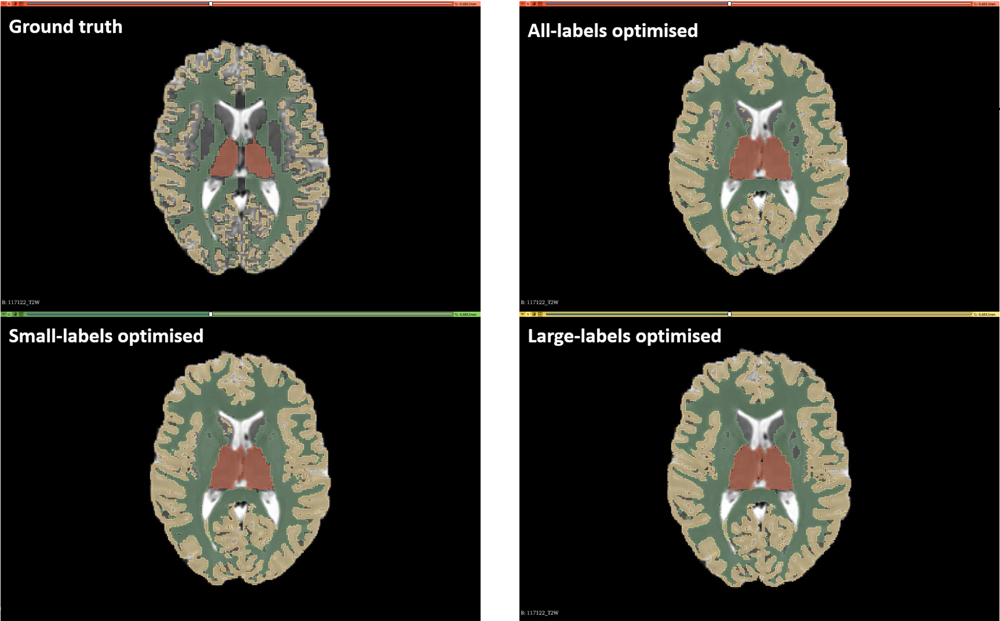
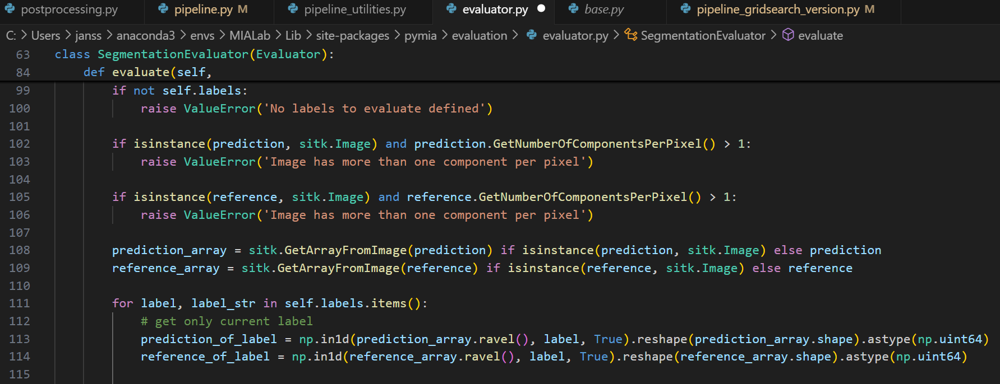
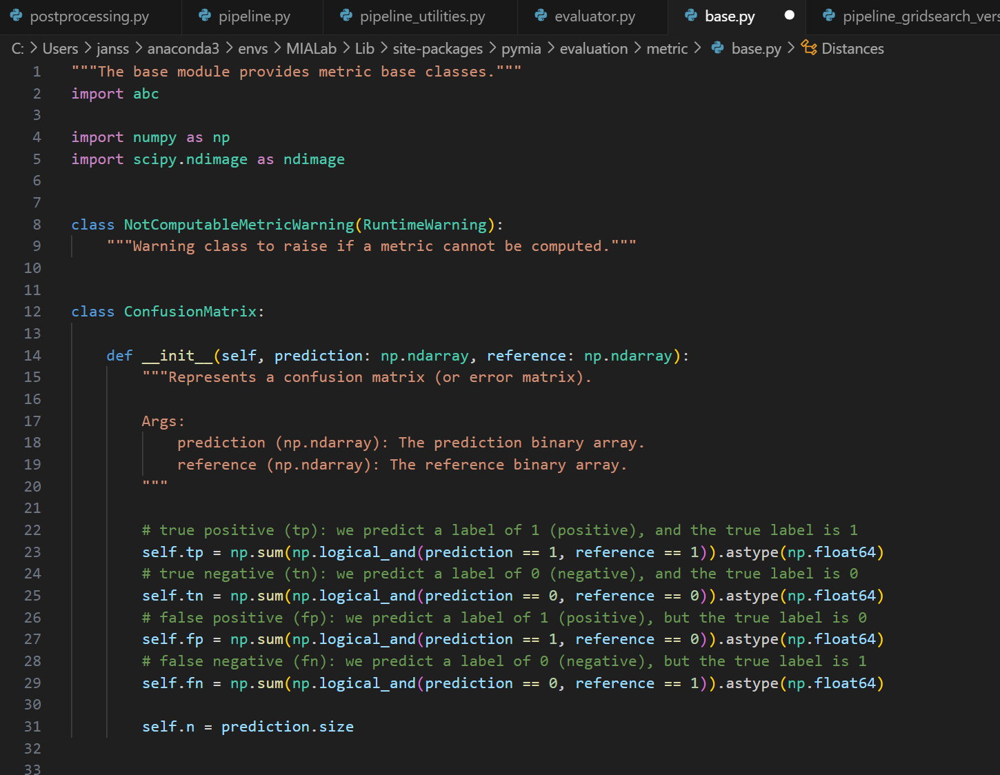

# Medical Image Analysis Laboratory



## Overview

Welcome to the medical image analysis laboratory (MIALab). This repository contains all the code you will need to get started with classical medical image analysis.

## Task

During the MIALab, you will work on the task of brain tissue segmentation from magnetic resonance (MR) images. We have set up an entire pipeline to solve this task, specifically:

- Pre-processing
- Registration
- Feature extraction
- Voxel-wise tissue classification
- Post-processing
- Evaluation

After you complete the exercises, dive into the `pipeline.py` script to learn how all of these steps work together.

## Learning Objectives

During the laboratory, you will get to know the entire pipeline and investigate one of these pipeline elements in-depth. You will get to know and use various libraries and software tools needed in the daily life of a biomedical engineer or researcher in the medical image analysis domain.

## Hypothesis 3: Evaluation

> Using different models tailored to small and large anatomical structures will reveal metric-specific biases,
highlighting the need for size-appropriate metric selection in segmentation evaluation.


Example questions:
- What metric hides the bad performance?
- What metrics would be required to report the results as accurately as possible?
- Do the labels matter?
- Can the labels be combined for evaluation?

## Abstract
Accurate evaluation of segmentation models in medical imaging is critical for their clinical applicability. However, the size of anatomical structures might influence the result of certain evaluation metrics. In this study,segmentation models tailored for small and large brain structures as well as a model indifferent to structure sizes are investigated to reveal metric-specific biases with respect to segmentation size. The performance of different evaluation metrics is compared over the amygdala, the thalamus, the hippocampus, white and grey matter. Statistical tests reveal that Dice coefficient, volumetric similarity and Rand index are more sensitive to structure size, whereas AUC and Hausdorff distance are less influenced. The findings highlight the importance of size-appropriate metric selection.

The full report can be found [here](Report_MIALAB_JanssenRobine_TaragolaElise_ComynLucas.pdf).


## Group Members

- Lucas Comyn
- Elise Taragola
- Robine Janssen

## Git Workflow

### Creating a Branch

1. Make a branch in the repository online.
2. Go to the terminal and execute the following commands:
    ```sh
    git pull
    git branch -a  # list of branches
    git checkout Elise
    ```

### Adding Changes

1. Add changes to your branch.
2. Execute the following commands:
    ```sh
    git add .
    git commit -m "Your commit message"
    git push
    ```

### Merging Branches

1. To merge your branch with the base branch, execute the following commands:
    ```sh
    git checkout base
    git merge Elise
    ```

## PYMIA Adaptation

A small adaptation was done because of numerical overflows in ceratin of the generated metrics. Needed for older versions of numpy.

- Line 113-114 in `pymia/evaluation/evaluator.py/`: 64uint instead of 8uint

- Line 23-29 in `pymia/evaluator/metric`: np.float64



